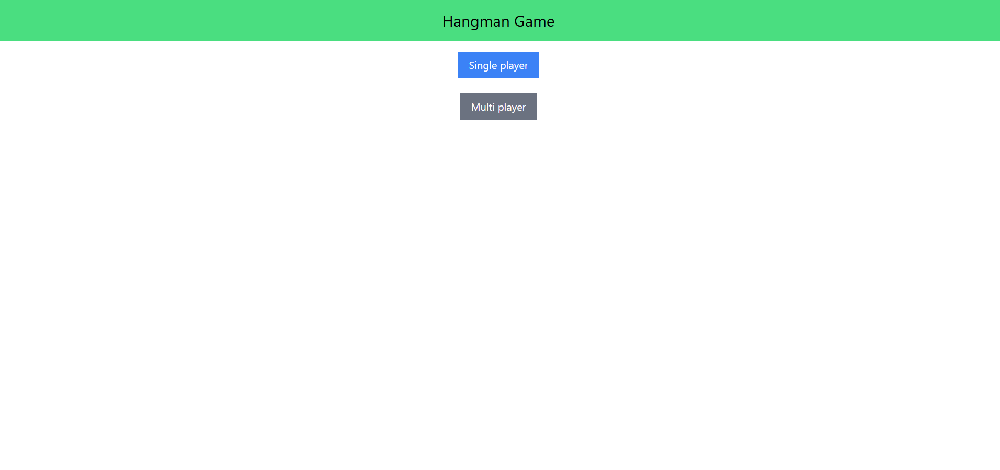

# Hangman-Game🚀

A modern implementation of the classic Hangman game built with React, showcasing the use of React Router DOM for naviagtion, Zustand for state management, and Tailwind CSS for styling.

## Features✨

* Classic Hangman gameplay
* Responsive design using Tailwind CSS
* State management with Zustand
* Navigation and routing with React Router DOM

## Technologies Used🌟
* React
* React Router DOM
* Zustand
* Tailwind CSS
* Vite
